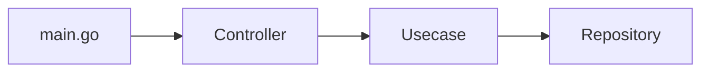

# Dependencies
- golang 1.18
- [air](https://github.com/cosmtrek/air) for auto reload app in development. to install it just type:

    go mod download
    
# Folder Structure

    .
    ├── controller                  # folder contains all file for handle route
    ├── usecase                     # folder contains all file for handle logic
    ├── repository                  # folder contains all file for working/with source data
    ├── entity                      # folder contains all file for entity
    ├── utils                       # utils folder
        ├── error.go                # custom error function
        ├── helper.go               # helper for handler returning response
    ├── .air.toml
    ├── Makefile                    # make file for run some command the app like run dev, run test etc
    ├── app.go                      # main endpoint file to run the application
    ├── go.mod
    ├── go.sum
    └── README.md
    
So the flow is:

 
# Run In Dev Mode
to run in dev mode, type:

    make run-dev
 
 then open **localhost:8080** in browser to access application
 endpoint for get name is:
 - **localhost:8080/name**

# Build For Production
to run for production

    make build
 
 # Run Unit Test
 Currently unit test cover for controller, usecase & domain. to run all unit test type:
 

    make run-tests
